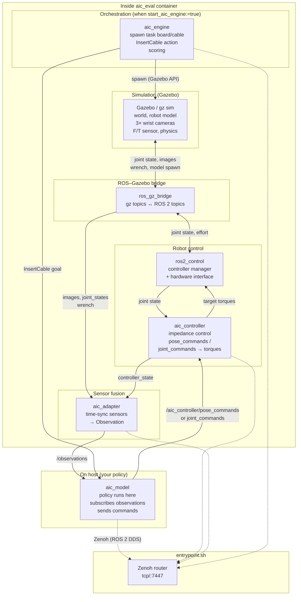

# Eval Container: Sim, Robot, and Controller Block Diagram

This document describes how the **simulation**, **robot**, and **controller** interact inside the **aic_eval** container (and when running the same stack from source).

---

## High-level block diagram



*(Mermaid: view in GitHub, VS Code, or any Markdown viewer that supports Mermaid.)*

---

## Same layout (ASCII)

```
┌─────────────────────────────────────────────────────────────────────────────────┐
│  entrypoint.sh                                                                  │
│    ┌──────────────┐                                                             │
│    │ Zenoh router │  tcp/:7447  (all ROS 2 traffic can go over Zenoh)           │
│    └──────┬───────┘                                                             │
└───────────┼─────────────────────────────────────────────────────────────────────┘
            │
┌───────────▼──────────────────────────────────────────────────────────────────────┐
│  INSIDE AIC_EVAL CONTAINER                                                       │
│                                                                                  │
│  ┌─────────────────────┐     ┌─────────────────────┐     ┌─────────────────────┐ │
│  │  SIMULATION         │     │  ROS–GAZEBO BRIDGE  │     │  ROBOT CONTROL      │ │
│  │  (Gazebo / gz sim)  │◄───►│  ros_gz_bridge      │◄───►│  ros2_control       │ │
│  │                     │     │                     │     │  + aic_controller   │ │
│  │  • World, robot     │     │  gz ↔ ROS 2         │     │                     │ │
│  │  • 3× wrist cams    │     │  joint_states,      │     │  • Subscribes:      │ │
│  │  • F/T sensor       │     │  images, wrench,    │     │    pose_commands /  │ │
│  │  • Physics          │     │  effort → gz        │     │    joint_commands   │ │
│  │  • Spawn API        │     │                     │     │  • Publishes:       │ │
│  └──────────┬──────────┘     └──────────┬──────────┘     │    controller_state │ │
│             │                            │               │   • Impedance →     │ │
│             │ spawn                      │               │   torques → HW      │ │
│             │                            │                └──────────┬─────────┘ │
│  ┌──────────▼──────────┐                 │                           │           │
│  │  aic_engine         │                 │                ┌──────────▼─────────┐ │
│  │  • Spawn task board │                 │                │  aic_adapter       │ │
│  │    & cable          │                 └──────────────► │  • Subscribes:     │ │
│  │  • InsertCable goal │                                  │    images,         │ │
│  │  • Scoring          │                                  │    joint_states,   │ │
│  └─────────────────────┘                                  │    wrench,         │ │
│                                                           │    controller_     │ │
│                                                           │    state           │ │
│                                                           │  • Publishes:      │ │
│                                                           │    /observations   │ │
│                                                           └──────────┬───────-─┘ │
└───────────────────────────────────────────────────────────────────────┼──────────┘
                                                                        │
                        Zenoh (tcp/localhost:7447)                      │
                                                                        │
┌───────────────────────────────────────────────────────────────────────▼───────────┐
│  ON HOST (your policy)                                                            │
│                                                                                   │
│  ┌─────────────────────┐         ┌─────────────────────┐                          │
│  │  aic_model          │         │  /observations      │                          │
│  │  • Policy (Python)  │◄────────│  /insert_cable      │  from container          │
│  │  • move_robot()     │────────►│  /aic_controller/   │  to container            │
│  │                     │         │  pose_commands      │                          │
│  └─────────────────────┘         │  (or joint_commands)│                          │
│                                  └─────────────────────┘                          │
└───────────────────────────────────────────────────────────────────────────────────┘
```

---

## Data flow (short)

| From | To | What |
|------|----|------|
| **Gazebo** | **ros_gz_bridge** | Joint positions/velocities, camera images, F/T wrench, entity spawn events. |
| **ros_gz_bridge** | **ROS 2 topics** | `/joint_states`, `/left_camera/image`, `/center_camera/image`, `/right_camera/image`, `/fts_broadcaster/wrench`, etc. |
| **ros_gz_bridge** | **ros2_control** | Joint state (from sim) and joint effort (from aic_controller). |
| **aic_controller** | **ros2_control** | Target joint torques (impedance + gravity comp). |
| **ros2_control** | **aic_controller** | Current joint state (used for impedance and `controller_state`). |
| **aic_adapter** | **aic_model** | Single time-synchronized **Observation** (images, joint_states, wrench, controller_state) on `/observations`. |
| **aic_model** | **aic_controller** | **MotionUpdate** (Cartesian) on `/aic_controller/pose_commands` or **JointMotionUpdate** on `/aic_controller/joint_commands`. |
| **aic_engine** | **Gazebo** | Spawn/delete task board and cable (via spawn API). |
| **aic_engine** | **aic_model** | **InsertCable** action goals (task and time limit). |

---

## Components in the container

| Component | Role |
|-----------|------|
| **Zenoh router** | Started by entrypoint; ROS 2 (rmw_zenoh_cpp) uses it so nodes in the container and on the host can discover and talk to each other (e.g. aic_model on host, aic_controller in container). |
| **Gazebo (gz sim)** | Runs the world, UR5e model, 3 wrist cameras, F/T sensor, and physics. Exposes gz topics and spawn/delete APIs. |
| **ros_gz_bridge** | Translates between Gazebo topics and ROS 2 topics (sensors and actuation). |
| **ros2_control** | Controller manager and hardware interface: connects the sim (via bridge) to the aic_controller. |
| **aic_controller** | Impedance controller: reads pose or joint targets from your policy, reads current state from ros2_control, computes torques, sends them back to the sim. Publishes `controller_state` (TCP pose, velocity, etc.). |
| **aic_adapter** | Subscribes to camera, joint, wrench, and controller_state; publishes a single **Observation** message at ~20 Hz for the policy. |
| **aic_engine** | (When `start_aic_engine:=true`) Orchestrates trials: spawns task board and cable in Gazebo, sends InsertCable to aic_model, collects scoring data. |

Your **aic_model** (with your policy) runs **on the host** and connects over Zenoh to the container so it receives `/observations` and `/insert_cable` and sends commands to `/aic_controller/pose_commands` or `joint_commands`.

---

## See also

- [Getting Started](./getting_started.md) – How to run the eval container and your policy.
- [AIC Interfaces](./aic_interfaces.md) – Topic and message reference.
- [AIC Controller](./aic_controller.md) – Controller pipeline and MotionUpdate / JointMotionUpdate.
